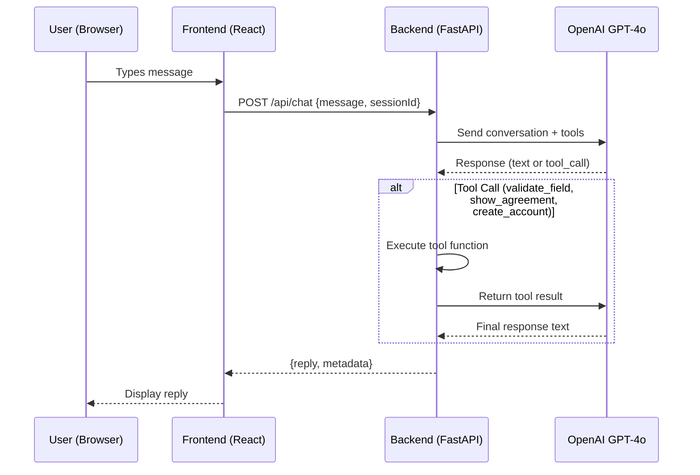

# Real AI Agent Integration

Replace the hardcoded state-machine chatbot with a real LLM-powered agent using **OpenAI GPT-4o** with **tool/function calling**. The AI agent lives on the backend and uses tools to validate data, present agreements, and create accounts.

## Architecture

> [!IMPORTANT]
> Requires an **OpenAI API key** set as `OPENAI_API_KEY` environment variable or in a `.env` file.

## Proposed Changes

### Backend

#### [NEW] [agent.py](file:///Users/gowrivallaban/Learning/Projects/account-open-agenticAI/server/agent.py)

The core AI agent module:

- **System prompt** — instructs GPT-4o to act as Apex Financial's account opening assistant, collecting required fields one by one, validating, reviewing, getting agreement consent, and creating the account
- **Tools (function calling):**
  - `validate_field(field_name, value)` — validates a single field using existing Pydantic logic
  - `show_agreement()` — returns the Terms & Conditions text for the user to review
  - `create_account(data)` — creates the account via the existing endpoint logic, returns account/routing numbers
- **Session management** — in-memory dict of `session_id → conversation_history` to maintain context across messages
- **Agentic loop** — processes tool calls iteratively until the model produces a final text response

#### [MODIFY] [main.py](file:///Users/gowrivallaban/Learning/Projects/account-open-agenticAI/server/main.py)

- Add `POST /api/chat` endpoint accepting `{message, sessionId}` — calls the agent and returns `{reply, metadata}`
- Keep existing `POST /api/accounts` for direct API access
- Add `python-dotenv` + `openai` to imports

#### [MODIFY] [requirements.txt](file:///Users/gowrivallaban/Learning/Projects/account-open-agenticAI/server/requirements.txt)

Add `openai` and `python-dotenv` dependencies.

---

### Frontend

#### [MODIFY] [ChatFlow.jsx](file:///Users/gowrivallaban/Learning/Projects/account-open-agenticAI/src/components/ChatFlow.jsx)

Replace the entire state-machine logic with a simple chat relay:
- Send user messages to `POST /api/chat` with a `sessionId`
- Display bot responses (text with markdown formatting)
- Keep the typing indicator, message bubbles, and input area
- Render structured data (account details) when metadata contains them
- Agreement is now handled conversationally by the AI agent (the agent asks "Do you agree?" and the user types their response)

Remove dependencies on `validators.js` and `Agreement.jsx` from the frontend (validation and agreement now live on the backend agent).

---

## Verification Plan

### Automated
1. Start backend with `OPENAI_API_KEY=... python3 -m uvicorn main:app --reload --port 8000`
2. Start frontend with `npm run dev`
3. Test via browser: open chatbot, walk through the full flow conversationally, verify the AI asks for each field, validates, shows T&C, and returns account numbers
